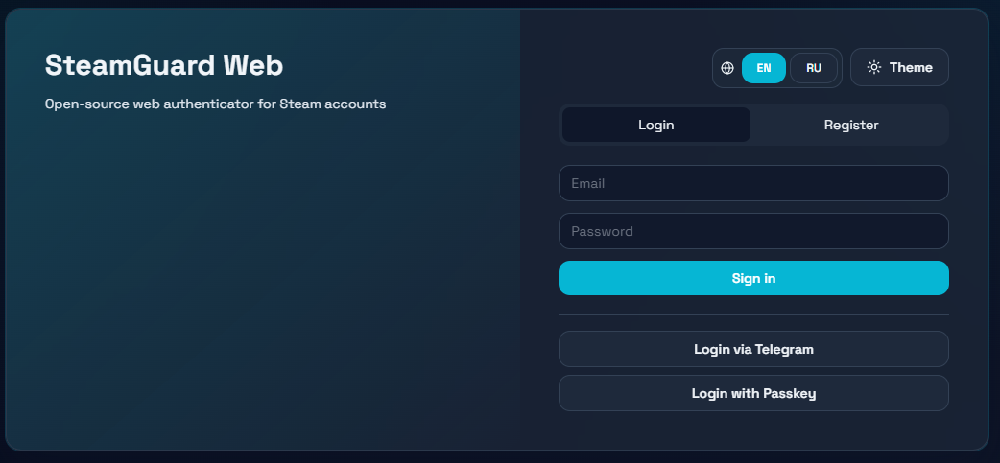
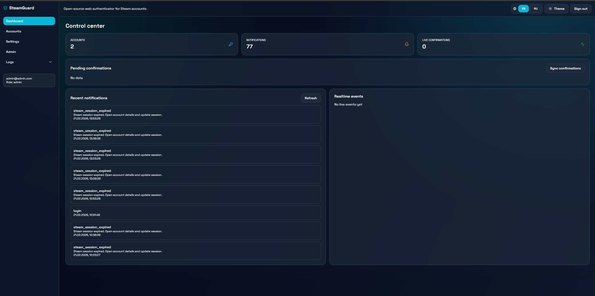
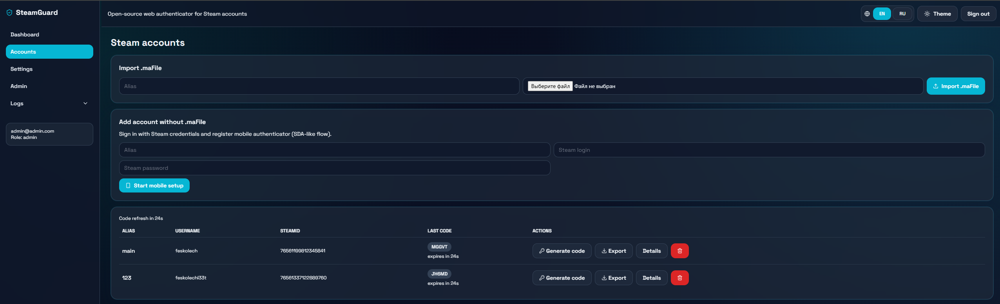
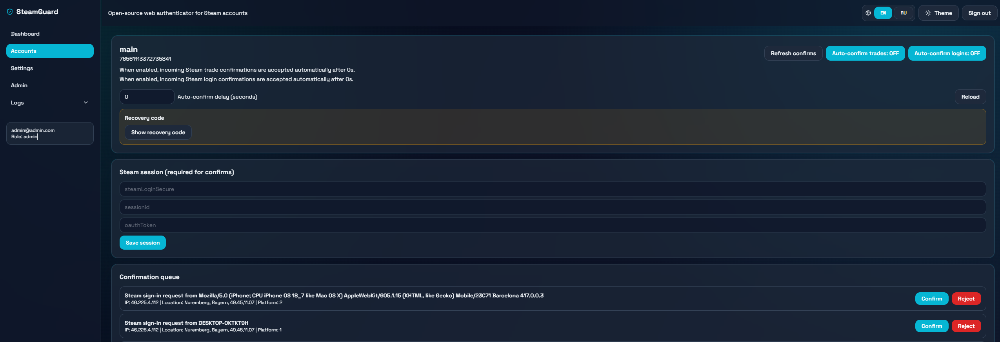
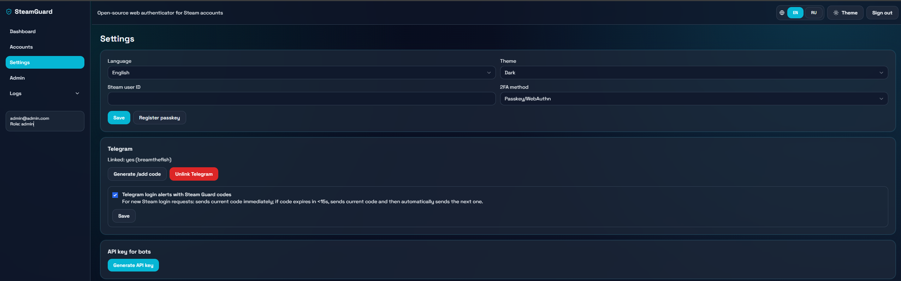
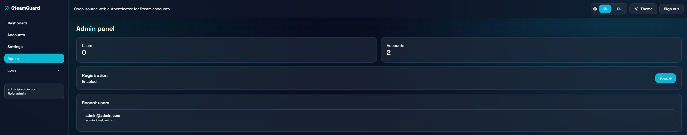
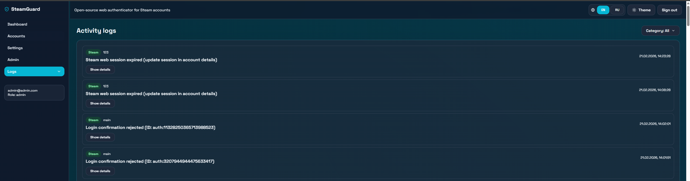

# SteamGuard Web

Open-source web implementation of Steam Desktop Authenticator (SDA) with multi-user and multi-account support.

- Backend: Fastify + TypeScript (API-first REST + WebSocket notifications)
- Frontend: React + Vite + Tailwind + PWA
- DB: MySQL 8 in Docker with encrypted MA files
- Bot: Aiogram (single Telegram bot for all users)
- License: MIT

## Why this stack

- **Fastify (instead of Express)**: lower overhead and better throughput for polling/real-time workloads.
- **TypeScript on backend/frontend**: safer refactoring and better API contracts.
- **MySQL 8 + Docker internal network**: relational consistency, easy VPS deploy, DB isolated from public access.
- **React + Vite + Tailwind**: fast DX + responsive UI + simple theming.
- **Vite PWA plugin**: installable app + service worker caching.
- **Aiogram bot**: mature async Telegram framework for command and deep-link flows.

## Key features

- MA file import/export (`.maFile`) with AES-256 encryption in DB.
- Multi-user + unlimited Steam accounts per user.
- Steam code generation from `shared_secret`.
- Trade/login confirmations API + queue + manual confirm/reject.
- Auto-confirm toggle with per-account delay (0-60s).
- Telegram OAuth-like login flow via bot deep-link.
- Telegram account linking with `/add=<code>` (15 min TTL).
- Telegram commands: `/accounts`, `/codes`, `/confirm <trade_id>`, `/status`.
- JWT cookie sessions, CSRF protection, Helmet, bcrypt, brute-force guard via `rate-limiter-flexible`.
- i18n EN/RU + light/dark theme.
- Admin panel with global registration toggle.
- Swagger docs at `/api-docs`.

## Default admin

- Email: `admin@admin.com`
- Password: `admin123`

(Override with `.env`: `ADMIN_EMAIL`, `ADMIN_PASSWORD`)

## Architecture

- Monolith API-first backend (`/api/...`) + WS (`/ws`) on port `3001`.
- Frontend SPA on port `3000`.
- Frontend server (Vite/Nginx) proxies `/api` and `/ws` to backend.
- MySQL is isolated in internal Docker network and not exposed externally.
- Optional reverse proxy service (`nginx`) in compose profile `proxy`.

## Project structure

```text
.
├── backend/                 # Fastify API (TypeScript)
├── frontend/                # React + Vite + Tailwind + PWA
├── bot/                     # Aiogram Telegram bot
├── docker/
│   ├── mysql/init.sql       # Schema bootstrap
│   └── nginx/nginx.conf     # Reverse proxy example
├── docker-compose.yml
├── docker-compose.dev.yml
├── Makefile
├── .env.example
└── README.md
```

## Quick start

```bash
cp .env.example .env
make dev
```

Open:
- Frontend: `http://localhost:3000`
- Backend API: `http://localhost:3001`
- Swagger: `http://localhost:3001/api-docs`

## Make targets

- `make dev` - Docker dev stack with hot reload.
- `make build` - build production images.
- `make up` - run production stack detached.
- `make deploy` - alias for `make up`.
- `make down` - stop and remove containers.
- `make lint` - backend + frontend lint.
- `make test` - backend Jest + frontend Cypress (via docker service).
- `make logs` - follow container logs.

## Environment variables

See `.env.example`.

Core variables:
- `DB_*` MySQL connection and bootstrap user credentials.
- `JWT_SECRET`, `COOKIE_SECRET`, `ENCRYPTION_KEY` security secrets.
- `APP_URL`, `API_URL` frontend/backend origins.
- `TELEGRAM_BOT_TOKEN`, `TELEGRAM_BOT_USERNAME` bot settings.
- `STEAM_POLL_INTERVAL_SEC` auto-confirm polling interval.

If `TELEGRAM_BOT_TOKEN` is empty or starts with `change_me`, bot service stays in disabled idle mode (no crash, API stays up).

## Security model

- **MA encryption**: AES-256-GCM per user.
- **Key derivation**: per-user key derived from bcrypt password hash + global `ENCRYPTION_KEY`.
- **Auth**: JWT in HTTP-only cookie.
- **CSRF**: double-submit protection for mutating endpoints.
- **Brute-force/DoS**: `rate-limiter-flexible` in auth/write paths.
- **Hardening**: `helmet`, CORS with credentials.
- **DB isolation**: MySQL only on internal Docker network (`db_internal`).

## Telegram flows

### Link Telegram account
1. In Settings click "Generate /add code".
2. Send `/add=<code>` to bot within 15 min.
3. Bot binds `telegram_user_id` to your web user.

### Login via Telegram
1. On login page click "Login via Telegram".
2. Open bot deep-link (`/start login_<code>`).
3. Bot confirms code.
4. Web page polls and creates session automatically.

## Steam confirmations notes

Steam mobile confirmations require valid session tokens (`steamLoginSecure`, `sessionid`, optional `oauthToken`).
You can set/update them in account detail page (`/accounts/:id`) or they are imported if present in `.maFile` session payload.

## Bot API integration

Internal bot endpoints are under `/api/telegram/bot/*` and protected by header:

- `x-telegram-bot-token: $TELEGRAM_BOT_TOKEN`

## Screenshots

### Login


### Dashboard


### Accounts


### Account Detail


### Settings


### Admin


### Logs


## Deployment on VPS

1. Install Docker + Docker Compose.
2. Clone repository.
3. `cp .env.example .env` and set production secrets.
4. Optionally set external reverse proxy to forward:
   - `/` -> frontend `:3000`
   - `/api` and `/ws` -> backend `:3001`
5. Run `make deploy`.

Optional bundled Nginx proxy:

```bash
docker compose --profile proxy up -d
```

## Testing

- Backend unit/API tests: Jest (`backend/tests/*`).
- Frontend unit tests: Vitest (`frontend/src/utils/format.test.ts`).
- E2E smoke: Cypress (`frontend/cypress/e2e/smoke.cy.ts`).

For local host runs Cypress may require system dependencies (`Xvfb`). `make test` uses `cypress/included` Docker image to avoid host setup issues.

## License

MIT (`LICENSE`).
